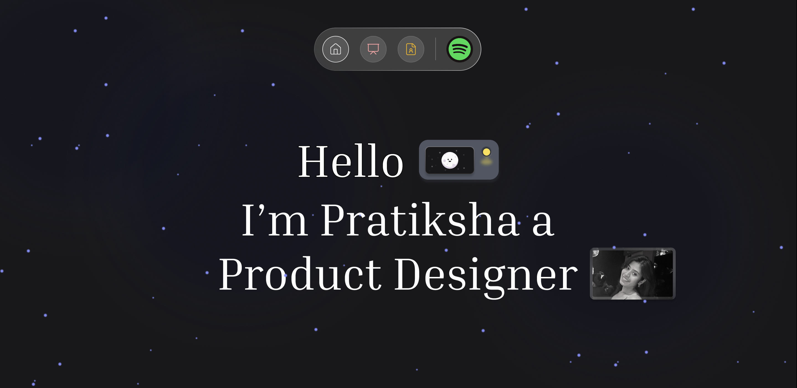
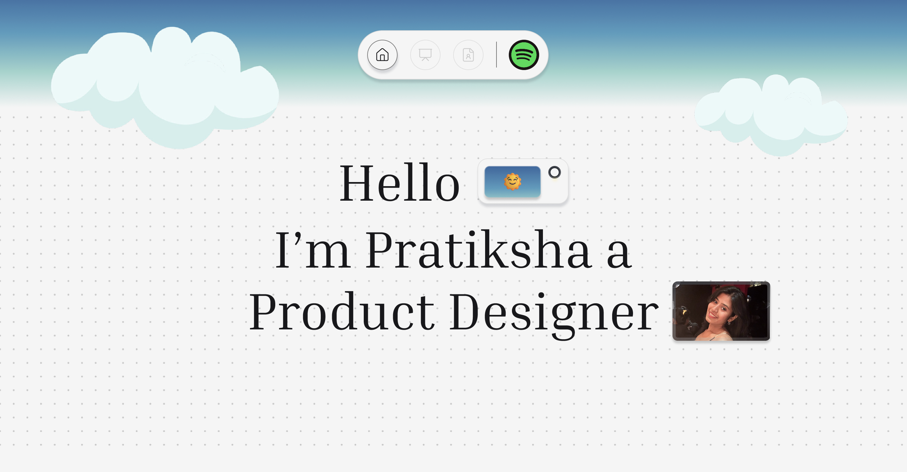

# 🌟 Pratiksha's Portfolio

A modern, interactive portfolio website showcasing product design work with stunning animations and responsive design.

## 📸 Preview

### Dark Mode


### Light Mode


## ✨ Features

- **🌓 Dual Theme Support**: Seamless dark/light mode toggle with persistent preferences
- **🎨 Interactive Skills**: Draggable skill tags with physics-based animations
- **📱 Responsive Design**: Optimized for all devices from mobile to desktop
- **🚀 Smooth Navigation**: Intelligent scrolling and section-aware navigation
- **🎭 Case Studies**: Detailed project showcases with clean layouts
- **⭐ Animated Backgrounds**: Dynamic star fields and floating clouds
- **🎯 Modern UI**: Glassmorphism effects and smooth transitions

## 🛠️ Tech Stack

- **React 18** - Modern UI framework
- **React Router** - Client-side routing
- **Material-UI** - Component library for grid layouts
- **CSS3** - Custom animations and responsive design
- **Local Storage** - Theme persistence

## 🚀 Getting Started

### Prerequisites
- Node.js (v14 or higher)
- npm or yarn

### Installation

1. **Clone the repository**
   ```bash
   git clone https://github.com/your-username/pratiksha-portfolio.git
   cd pratiksha-portfolio
   ```

2. **Install dependencies**
   ```bash
   npm install
   ```

3. **Start the development server**
   ```bash
   npm start
   ```

4. **Open your browser**
   Navigate to [http://localhost:3000](http://localhost:3000)

## 📁 Project Structure

```
src/
├── components/          # Reusable UI components
│   ├── Navigation.js    # Animated navigation bar
│   ├── WorkItem.js      # Portfolio item component
│   ├── SkillTag.js      # Interactive skill tags
│   ├── CaseStudy.js     # Case study layout
│   └── SpaceBackground.js # Dynamic backgrounds
├── layout/
│   └── Portfolio.js     # Main portfolio layout
├── styles/              # CSS modules
│   ├── Portfolio.css    # Main styles
│   ├── Navigation.css   # Navigation styles
│   └── CaseStudy.css    # Case study styles
└── public/              # Static assets
    ├── erp.png         # Project images
    ├── clevertap.png
    ├── ecoden.png
    └── asign.png
```

## 🎨 Key Components

### Navigation
- Intelligent active states based on scroll position
- Smooth scrolling to sections
- Glassmorphism design with animated border

### Hero Section
- Dynamic theme toggle with custom images
- Animated profile interactions
- Responsive typography

### Interactive Skills
- Physics-based drag and drop
- Collision detection
- Floating animations

### Case Studies
- Clean, readable layouts
- Responsive image galleries
- Optimized for mobile reading

## 🌈 Theme System

The portfolio features a sophisticated theme system:
- **Dark Mode**: Space theme with stars and dark backgrounds
- **Light Mode**: Cloud theme with bright, clean aesthetics
- **Persistence**: Theme preferences saved across sessions
- **Smart Switching**: Seamless transitions between themes

## 📱 Responsive Design

Optimized breakpoints for:
- **Mobile**: < 480px
- **Tablet**: 481px - 768px
- **Desktop**: > 768px

## 🚀 Performance Features

- **Code Splitting**: Modular component architecture
- **Optimized Images**: Proper sizing and compression
- **Smooth Animations**: Hardware-accelerated transitions
- **Efficient Rendering**: React best practices

## 🛠️ Available Scripts

| Command | Description |
|---------|-------------|
| `npm start` | Development server with hot reload |
| `npm test` | Run test suite |
| `npm run build` | Production build |
| `npm run eject` | Eject from Create React App |

## 🎯 Browser Support

- Chrome (latest)
- Firefox (latest)
- Safari (latest)
- Edge (latest)

## 📄 License

This project is licensed under the MIT License.

---

**Built for Pratiksha** | [View Live Demo](https://pratiksha-portfolio-design.netlify.app/)
